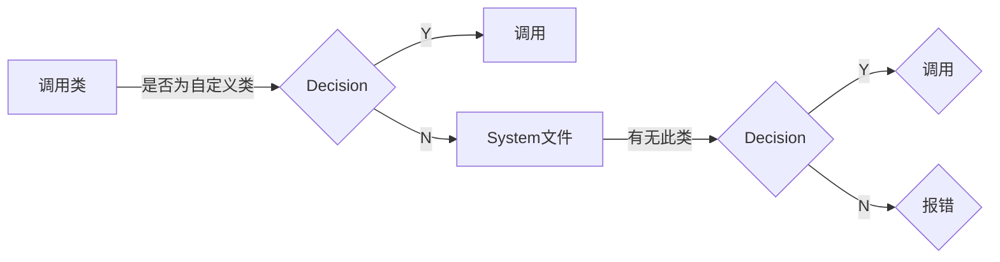

#编程 #Csharp

## 一、VS & VSCode

正所谓“工欲善其事必先利其器”。一个好的代码编辑器(&IDE)不仅能使代码变得更美观，增强其可读性，同时也能迅速推进程序员的工作进程，延长代码的生命周期。而在C#的主流编辑器中VS无疑是最好的选择。

- [VS官网](https://visualstudio.microsoft.com/zh-hans/vs/)
- [VSCode官网](https://code.visualstudio.com/)

> 在之后的教程，我会以VS2019作为主要的演示工具。

### 1. 创建C#项目

#### 1). VS的开发环境

首先你得安装了vs2019，然后确认下下面三个组件是否存在，如果没有要下载一下。


#### 2). 创建项目

1). 打开VS后会出现下面的页面，鼠标点击创建新项目：


2). 搜索框下有三个下拉框，第一个和第二个不用管它，点击第三个，选择“控制台”，然后选择“控制台应用程序”，然后鼠标点击下一步：


3). 选择好项目存放的位置，然后鼠标点击下一步:


4). 这里选择.NET的框架，这里我用的是.NET6.0的预览版，然后鼠标点击下一步:


5). 这样我们就创建了一个C#项目。

## 二、Hello World 实例

在VS的编辑页面(Program.cs)输入一下内容：

```CSharp
using System;
using System.Collections.Generic;
using System.Linq;
using System.Text;
using System.Threading.Tasks;

// 项目名称为 001-开始
namespace _001_开始
{
    // 类名为 Program
    class Program
    {
        // main函数
        static void Main(string[] args)
        {
            Console.Write("Hello");
            Console.WriteLine("_World");
            Console.WriteLine("Hello_Wrold");
        }
    }
}
```

然后`Ctrl+F5`编译运行Cs文件就可以看到输出的结果：

```Output
Hello_World
Hello_World
```

### 1. 简要概述

#### 1.1 using 关键字

> using System

引用System命名空间。其中储存着程序自带的类。

调用类的顺序:



如果你不想引用 System 命名空间，你也可以通过 `System.类.方法` 的方式调用其中的类。

**using** 关键字用于在程序中包含命名空间。一个程序可以包含多个 using 语句。

#### 1.2 命名空间

> namespace _001_开始{}

声明一个命名空间名为`_001_开始`，在大括号中间的都是该命名空间的成员。

通常情况下该类的名称就是项目的名称。

#### 1.3 class 关键字

> class Program{}

声明一个新的类类型，在大括号中间的都是该类的成员。

#### 1.4 main 方法

> static void Main(string[] args){}

声明一个Main方法，作为Progarm类的成员，它是所有程序的入口。

#### 1.5 输出函数

> Console. Write ("Hello");
> Console.WriteLine("_World");

`Console`是一个类(微软准备好的)，而`Write&WriteLine`是Console类下的方法(&函数)。其作用是打印输出。

### 2. 类&命名空间

什么是命名空间呢？比如说我们有一千个类，当你想使用其中一个类的时候，你会发现找起来很麻烦，就好比我们有一千本书，当我们需要看其中一本的时候，你要找就必须一本一本的去找，直到找到这本书为止，非常麻烦。

命名空间呢就是用来把类当然还有其它的一些类型，用良好的结构组织在一起，这样的一个作用，就好比下面的这个图书馆，图书馆里边的书不是随便放的，他是按照一定逻辑分门别类放置，如果你想找一本书的话，你就看看这本书属于哪一类第几本，就能很轻易的在一堆书山中找到你想找到的书，而且我们在非常多的书的情况下，有些书是同名的，但这些书名字虽然一样，却属于不同的学科，所以说命名空间也能有效的避免同名的类之间命名的冲突。

#### 类库

命名空间和类共同储存在类库中。类库的引用是使用名称空间的物理基础。不同技术类型的项目会默认引用不同的类库。


### 3. Main 方法

在一个C#项目中通常通过编写`Program.cs`文件来达到预定效果。

在`Program.cs`中定义了**Program类**，其中包括**Main方法**。在编译过程中编译器只会取Main方法中的代码，所以我们可执行代码和自定义方法都要写在Main方法里。简而言之，所有的可执行代码都要写在方法中，而方法必须包含在类或结构中。

一般情况下,一个C#可执行程序只有一个应用程序对象(也就是就程序入口),但是在某些情况,可能会有多个应用程序对象(程序入口),如单元测试中,这个时候我们就需要通过命令行指定以哪个Main()方法作为程序的入口。而在默认情况下，只有一个Main()方法。

#### 概述

- `Main` 方法是可执行程序的入口点，也是程序控制开始和结束的位置。
- `Main` 在类或结构中声明。 `Main` 必须是 [`static`](https://learn.microsoft.com/zh-cn/dotnet/csharp/language-reference/keywords/static)，它不需要是 [`public`](https://learn.microsoft.com/zh-cn/dotnet/csharp/language-reference/keywords/public)。 （在前面的示例中，它获得的是[`private`](https://learn.microsoft.com/zh-cn/dotnet/csharp/language-reference/keywords/private)成员的默认访问权限）。封闭类或结构不一定要是静态的。
- `Main` 的返回类型可以是 `void`、`int`、`Task` 或 `Task<int>`。
- 当且仅当 `Main` 返回 `Task` 或 `Task<int>` 时，`Main` 的声明可包括 [`async`](https://learn.microsoft.com/zh-cn/dotnet/csharp/language-reference/keywords/async) 修饰符。 这明确排除了 `async void Main` 方法。
- 使用或不使用包含命令行自变量的 `string[]` 参数声明 `Main` 方法都行。 使用 Visual Studio 创建 Windows 应用程序时，可以手动添加此形参，也可以使用 [GetCommandLineArgs()](https://learn.microsoft.com/zh-cn/dotnet/api/system.environment.getcommandlineargs#system-environment-getcommandlineargs) 方法来获取命令行实参。 参数被读取为从零开始编制索引的命令行自变量。 与 C 和 C++ 不同，程序的名称不被视为 `args` 数组中的第一个命令行实参，但它是 [GetCommandLineArgs()](https://learn.microsoft.com/zh-cn/dotnet/api/system.environment.getcommandlineargs#system-environment-getcommandlineargs) 方法中的第一个元素。

### 4. 语句

语句就是执行操作的命令，即一条完整指令。我们可以通过语句控制计算机操作。

举个例子，一位老板雇了一批非洲工人，老板想要分配工作，但是语言不通，无法理解对方的意思；这时就需要一个翻译官来将老板的话进行翻译，然后转述给工人。

换句话说，老板的指令经过翻译官翻译后翻译成了工人能理解的语言，进而部署工人。现在计算机就是工人，而你就是老板，计算机只能识别机器语言(二进制语言)，但是不理解高级编程语言。这时就需要编译器的转义，将高级编程语言编译为机器语言。语句就是老板的命令，它虽然不可以直接操作计算机，但是可以通过编译器来间接实现。

语句通常以";"结尾，表示语句结束。

常见的语句类型：

- `声明语句`：声明语句引入新的变量或常量。 变量声明可以选择为变量赋值。 在常量声明中必须赋值。
- `表达式语句`：用于计算值的表达式语句必须在变量中存储该值。
- `选择语句`：选择语句用于根据一个或多个指定条件分支到不同的代码段。 有关详细信息，请参阅下列主题：
  - if
  - switch
- `迭代语句`：迭代语句用于遍历集合（如数组），或重复执行同一组语句直到满足指定的条件。 有关详细信息，请参阅下列主题：
  - do
  - for
  - foreach
  - while
- `跳转语句`：跳转语句将控制转移给另一代码段。 有关详细信息，请参阅下列主题：
  - break
  - continue
  - goto
  - return
  - yield
- `异常处理语句`：异常处理语句用于从运行时发生的异常情况正常恢复。 有关详细信息，请参阅下列主题：
  - throw
  - try-catch
  - try-finally
  - try-catch-finally
- checked 和 unchecked：checked 和 unchecked 语句用于指定将结果存储在变量中、但该变量过小而不能容纳结果值时，是否允许整型数值运算导致溢出。
- `await 语句`：如果用 async 修饰符标记方法，则可以使用该方法中的 await 运算符。 在控制到达异步方法的 await 表达式时，控制将返回到调用方，该方法中的进程将挂起，直到等待的任务完成为止。 任务完成后，可以在方法中恢复执行。
- `yield return 语句`：迭代器对集合执行自定义迭代，如列表或数组。 迭代器使用 yield return 语句返回元素，每次返回一个。 到达 yield return 语句时，会记住当前在代码中的位置。 下次调用迭代器时，将从该位置重新开始执行。
- `fixed 语句`：fixed 语句禁止垃圾回收器重定位可移动的变量。
- `lock 语句`：lock 语句用于限制一次仅允许一个线程访问代码块。
- `带标签的语句`：lock 语句用于限制一次仅允许一个线程访问代码块。
- `空语句`：空语句只含一个分号。 不执行任何操作，可以在需要语句但不需要执行任何操作的地方使用。

这里只需要有一个了解就可以，C#基础的学习就是主要围绕着语句的展开的。

### 5. 标识符

标识符是对程序中元素命名的名称，用来识别类、变量、函数或任何其它用户定义的项目。

#### 5.1 命名规则

- 只能使用字母(大写和小写)、数字和下划线(_)
- 标识符必须以字母或下划线开头

> 例如，result，_score，num9是有效标识符；score&，9num不是。

> [!quote] 重要提示
> C#区分大小写、Hello_World和Hello_world是不同的标识符

#### 5.2 命名规范

##### 5.2.1 驼峰命名法（Camel 命名法）

首个单词的首个字母小写，其余单词的首字母大写(enemyHp).

##### 5.2.2 Pascal 命名规范

每个单词开头的字母大写(如 TestCounter).

如果使用到英文单词的缩写，全部使用大写(PI HP MP).

###### 5.2.2.1 类命名规则

- 类名应该为名词及名词短语，尽可能使用完整的词.
- 使用Pascal规则
- 不要使用类前缀 - 不要使用下划线字符 (_ )。
- 有时候需要提供以字母 I 开始的类名称，虽然该类不是接口。只要 I 是作为类名称组成部分的整个单词的第一个字母，这便是适当的。例如，类名称 IdentityStore 就是适当的。
- 在适当的地方，使用复合单词命名派生的类。派生类名称的第二个部分应当是基类的名称。例如，ApplicationException 对于从名为 Exception 的类派生的类是适当的名称，原因是 ApplicationException 是一种 Exception。请在应用该规则时进行合理的判断。例如，Button 对于从 Control 派生的类是适当的名称。尽管按钮是一种控件，但是将 Control 作为类名称的一部分将使名称不必要地加长。

###### 5.2.2.2 接口命名规则

- 接口名称应该为名词及名词短语或者描述其行为的形容词，尽可能使用完整的词. (Example IComponent or IEnumberable)
- 使用Pascal规则
- 使用字符I为前缀，并紧跟一个大写字母（即接口名的第一个字母大写）

复制代码代码如下:

```C#
interface ICompare
{
int Compare();
}
```

###### 5.2.2.3 枚举命名规则

- 对于 Enum 类型和值名称使用 Pascal 大小写。
- 少用缩写。
- 不要在 Enum 类型名称上使用 Enum 后缀。
- 对大多数 Enum 类型使用单数名称，但是对作为位域的 Enum 类型使用复数名称。
- 总是将 FlagsAttribute 添加到位域 Enum 类型。

###### 5.2.2.4 变量命名

- 在简单的循环语句中计数器变量使用 i, j, k, l, m, n
- 使用 Camel 命名规则

###### 5.2.2.5 方法命名

- 使用Pascal规则
- 对方法名采用一致的动词/宾语或宾语/动词顺序。例如，将动词置于前面时，所使用的名称诸如 InsertWidget 和 InsertSprocket；将宾语置于前面时，所使用的名称诸如 WidgetInsert 和 SprocketInsert。
- 推荐名称应该为动词或动词短语.例如Save，SaveCustomer，而不要使用CustomerSave
- 不要在方法中重复类的名称。例如，如果某个类已命名为 Book，则不要将某个方法称为 Book.CloseBook，而可以将方法命名为 Book.Close。

###### 5.2.2.6 属性命名

- 名称应该为名词及名词短语
- 使用Pascal规则
- 对于bool型属性或者变量使用Is（is）作为前缀，不要使用Flag后缀，例如应该使用IsDeleted,而不要使用DeleteFlag

###### 5.2.2.7 集合命名

- 名称应该为名词及名词短语
- 使用Pascal规则
- 名称后面追加“Collection”

###### 5.2.2.8 事件命名

- event handlers命名使用 EventHandler 后缀.
- 两个参数分别使用 sender 及 e
- 使用Pascal规则
- 事件参数使用EventArgs 后缀
- 事件命名使用语法时态反映其激发的状态，例如 Changed，Changing.
- 考虑使用动词命名. 变量命名
- 在简单的循环语句中计数器变量使用 i, j, k, l, m, n
- 使用 Camel 命名规则

###### 5.2.2.9 自定义的属性以 Attribute 结尾

代码如下:

```C#
public class AuthorAttribute : Attribute
{
}
```

###### 5.2.2.10 自定义的异常以 Exception 结尾

复制代码代码如下:

```C#
public class AppException : Exception
{
}
```

###### 5.2.2.11 在类的顶部声明所有的成员变量，静态变量声明在最前面

```C#
// Correct
public class Account
{
    public static string BankName;
    public static decimal Reserves;
    
    public string Number {get; set;}
    public DateTime DateOpened {get; set;}
    public DateTime DateClosed {get; set;}
    public decimal Balance {get; set;}
    
    // Constructor
    public Account()
    {
        // ...
    }
}
```

###### 5.2.2.12 不推荐使用匈牙利命名法

不要给成员变量加任何前缀（如、m、s_等等）。如果想要区分局部变量和成员变量，可以使用this关键字。

### 5. 关键字

C#语言提供了77个标识符，程序员不可将其作为类、变量、函数或任何其它用户定义的项目的名称。这些标识符就称为关键字，每个关键字都有自己的特定含义。

这些关键字不能用作标识符，但是，如果您想使用这些关键字作为标识符，可以在关键字前面加上 @ 字符作为前缀。

这些关键字不能用作标识符，但是，如果您想使用这些关键字作为标识符，可以在关键字前面加上 @ 字符作为前缀。

下表列出了 C# 中的保留关键字（Reserved Keywords）和上下文关键字（Contextual Keywords）：
![[关键字.png]]

### 6. 注释

注释是用于解释代码。编译器会忽略注释的条目。在 C# 程序中，多行注释以 /* 开始，并以字符 * / 终止，如下所示：

```C#
/* 
  * 这个程序演示
  * C# 的注释使用 
  */
```

单行注释是用 // 符号表示。例如：

```C#
// 这一行是注释 
```

/// 文档注释

```C#
///这是一个文档注释
```

注释的作用: - 解释: 说明代码作用

```C#
- 注销:将暂时不需要的代码注销
```
